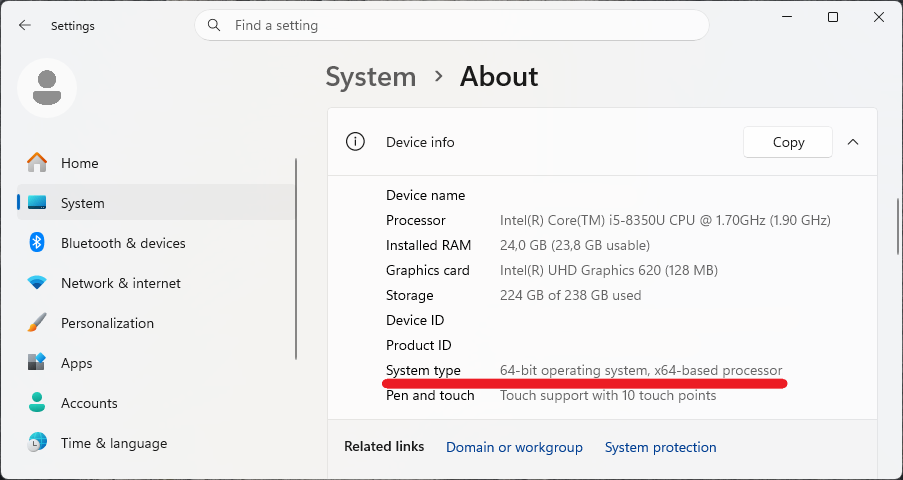
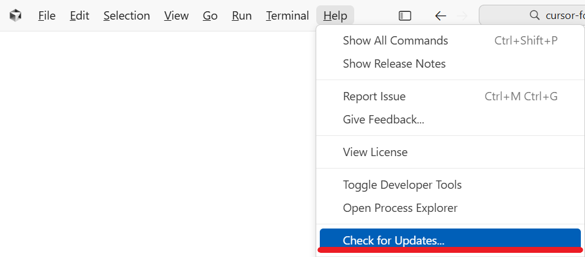
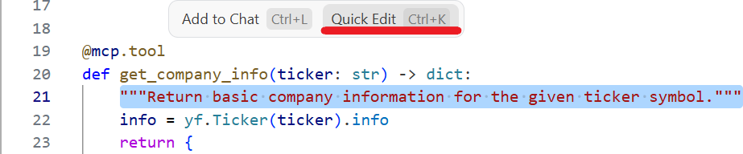
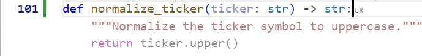
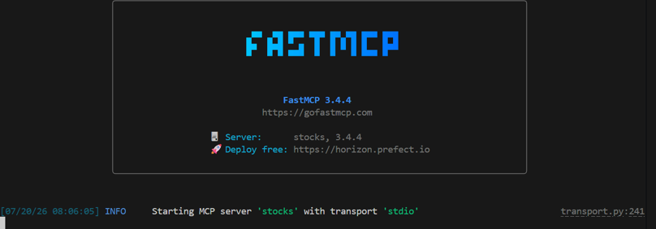

# Cursor for Python Engineers: A Hands-On Workshop

**Duration:** 1h 40 minutes  
**Audience:** Python Engineers  
**IDE Version:** Cursor Agentic Windows Desktop IDE ver. `3.17.21`  
**Practice project:** A Python Model Context Protocol (MCP) server built with [FastMCP Python library](https://gofastmcp.com/)

## Table of contents

- [Workshop Overview](#workshop-overview)  
- [Participant Prerequisites](#participant-prerequisites) 
- [**Part 1:** Introduction to Cursor](#part-1-introduction-to-cursor)  
    - [What is Cursor?](#what-is-cursor)  
    - [Ownership](#ownership)  
    - [How to Download and Install Cursor](#how-to-download-and-install-cursor)  
    - [How to Update Cursor](#how-to-update-cursor)  
    - [Promotions, Trials, and Discounts](#promotions-trials-and-discounts)  
    - [Community and Resources](#community-and-resources)  
- [**Part 2:** Fast Edits and Navigation](#part-2-fast-edits-and-navigation)  
    - [When to Use Each Cursor Feature](#when-to-use-each-cursor-feature)
    - [Prompt Templates](#prompt-templates)
        - [Explore before changing](#explore-before-changing)
        - [Plan a multi-file change](#plan-a-multi-file-change)
        - [Implement a reviewed plan](#implement-a-reviewed-plan)
        - [Diagnose a failure](#diagnose-a-failure)
- [**Part 3:** Practical Exercise - Building an MCP Server](#part-3-practical-exercise---building-an-mcp-server)
    - [Understanding MCP](#understanding-mcp)  
        - [The three primitives of MCP](#the-three-primitives-of-mcp)  
    - [Building with FastMCP](#building-with-fastmcp)  
    - [Testing the Server](#testing-the-server)  
- [**Part 4:** Cursor Workflows & Best Practices](#part-4-cursor-workflows--best-practices)  
    - [Weak vs Strong Prompts](#weak-vs-strong-prompts)
    - [Checklist: Avoiding Common AI Pitfalls](#checklist-avoiding-common-ai-pitfalls)

## Workshop Overview

Cursor (by Anysphere/SpaceX) can feel like magic - until it doesn't. In this beginner-friendly, hands-on workshop, you'll learn a practical workflow for building and changing real Python code with Cursor without getting lost.

This workshop teaches a repeatable, safe workflow for using Cursor to plan, implement, inspect, refactor, and debug real Python changes. We will cover:

* Planning small tasks and generating multi-file changes with Cursor Composer feature.
* Iterating safely using Chat + Apply diffs.
* Navigating quickly with code search.
* Speeding up everyday edits with inline completion and the inline editor.

## Participant Prerequisites

Participants should bring:

- A laptop with Windows 11, macOS, or a supported Linux distribution (e.g., [Ubuntu](https://ubuntu.com/)).
- [Cursor](https://cursor.com/download) installed and signed in.
- [Python](https://www.python.org/downloads/) 3.11 or later available in a terminal.
- Git installed (e.g., [Git Bash for Windows](https://git-scm.com/install/windows)).
- [Node.js](https://nodejs.org/en) 18+.
- A working internet connection for package installation and finance market-data requests.

No prior experience with Cursor, MCP, FastMCP, or AI-assisted coding is required. Basic Python functions, imports, and terminal commands are helpful.

## Part 1: Introduction to Cursor

### What is Cursor?

Cursor is an AI-first [IDE (Integrated Development Environment)](https://en.wikipedia.org/wiki/Integrated_development_environment) built as a fork of [VS Code](https://code.visualstudio.com/). It integrates advanced [Large Language Models (LLMs)](https://en.wikipedia.org/wiki/Large_language_model) directly into the code editor, allowing developers to generate, edit, and debug code through natural language prompts and highly context-aware auto-completion.

For this workshop, think of Cursor as a **fast collaborator inside your editor**, not an autopilot. It is useful when you provide clear goals, relevant context, boundaries, and a way to verify the result.


**Pros:**

* ✅ **Familiar Interface**, because it is a [VS Code](https://code.visualstudio.com/) fork, all your favorite extensions, themes, and keybindings work out of the box.
* ✅ Keeps coding, review, terminal work, and AI assistance in **one workspace**.
* ✅ **Deep Context**. Cursor understands your entire codebase, reading across multiple files to provide accurate suggestions.
* ✅ **Agentic Capabilities**. Features like Composer can plan and execute complex, multi-file code changes.
* ✅ **Speeds up routine** edits, boilerplate, navigation, and first drafts.
* ✅ **Useful** for explaining unfamiliar code and generating test cases.
* ✅ **Helps beginners** turn intent into a concrete next step.

**Cons:**

* ❌ **Cloud Reliance:** Features require an active internet connection to communicate with the cloud-hosted LLMs.
* ❌ **Cost:** While there is a free tier, heavy professional use requires a monthly or yearly [subscription](https://cursor.com/pricing).
* ❌ **Occasional Hallucinations:** Like all AI tools, it can sometimes confidently invent APIs, imports, behavior, or facts.
* ❌ **You are responsible** for security, correctness, licensing, and data handling
* ❌ **Generated tests can repeat** the same **misunderstanding** as the implementation
* ❌ **Overreliance** can slow skill development and hide fundamentals

### Ownership

Cursor was created by **Anysphere**, an AI research startup backed by prominent investors including OpenAI Startup Fund and Andreessen Horowitz (a16z). **SpaceX** officially completed its $60 billion all-stock acquisition of Cursor (parent company Anysphere) on August 14, 2026 [[source](https://cursor.com/blog/joining-spacex)].

### How to Download and Install Cursor

Cursor is cross-platform. To install:

1. Navigate to the official website at [cursor.com/download](https://cursor.com/download).
2. Download the appropriate installer for your operating system (e.g., Windows `.exe`, macOS `.dmg`, or Linux).

    For Windows operating system, you can check your system type (`x64` vs `ARM64`) in the `Settings > System > About`:

    

3. Find the downloaded file (e.g., `CursorSetup-x64-3.17.21.exe`).
4. Follow the install steps for your OS:
    - **Windows**: Run the installer and follow the on-screen prompts,
    - **macOS**: Drag Cursor into your `Applications` folder,
    - **Linux**: Install via your package manager (`apt` or `dnf`) if available, or extract the `AppImage/archive` and run it.
4. Open `Cursor` from your applications menu or desktop.
5. Sign in with your [Cursor account](https://cursor.com/dashboard) when prompted.
6. On first launch, you will be prompted to optionally import your [VS Code](https://code.visualstudio.com/) settings and extensions.

### How to Update Cursor

Keeping your IDE updated ensures you have the latest AI models and bug fixes.

1. Open Cursor.
2. Navigate to the top menu bar.
3. Click on `Help`, and select `Check for Updates…`:

        

4. Cursor will download and apply any available updates.
5. Select **Restart to Update** when Cursor is ready.

### Promotions, Trials, and Discounts

As of late August 2026, the most reliable public ways to reduce Cursor cost are:

- **Free Hobby tier:** Cursor offers a no-cost entry tier for light use. It is the safest option for participants who only need Cursor for this workshop. Hobby tier includes:
    - No credit card required
    - Limited Agent requests
    - Access to Composer
- **Annual billing:** Yearly billing is 20% less expensive than monthly billing. Check the [pricing page](https://cursor.com/pricing) for the current price and terms before purchasing.

### Community and Resources

* **Cursor Ambassador Program:** Passionate about Cursor? Apply to become an ambassador and help grow the community: [https://cursor.com/ambassadors](https://cursor.com/ambassadors). Benefits listed include early feature access, personal credits, meetup funding, community Slack access, and merchandise.
* **Community Forum:** The official community forum is [forum.cursor.com](https://forum.cursor.com/). It includes announcements, discussions, support, ideas, guides, showcases, meetups, and account/billing information. Use it to find known issues, share workflows, request features, and ask reproducible technical questions.

## Part 2: Fast Edits and Navigation

### When to Use Each Cursor Feature

| Need | Suggested feature | Safe usage pattern |
|---|---|---|
| Locate a symbol, filename, string, or call site | Code search | Search first; open and read results before prompting |
| Ask about existing code or request a focused diff | Chat + Apply | Attach/mention specific files or selections; review diff before applying |
| Coordinate an intentionally scoped change across several files | Composer | Start with a plan, define file boundaries, then inspect the entire diff |
| Rename, rewrite, or add a few local lines | Inline editor | Select the exact code; make one small instruction |
| Fill in a predictable line or local block | Tab completion | Accept only after reading; reject or edit incorrect suggestions |

### Prompt Templates

#### Explore before changing

```text
Read @stocks_server.py and @tests/test_stocks_server.py.
Explain the current data flow from MCP tool call to returned response.
List assumptions and likely failure points. Do not edit files.
```

#### Plan a multi-file change

```text
We need to add ticker validation and tests.

Requirements:
- Accept uppercase and lowercase ticker input.
- Reject blank values and characters other than letters, digits, dots, and hyphens.
- Keep public tool names and response keys unchanged.
- Add tests for valid and invalid inputs.

First, give a concise implementation plan, including files to change and verification commands. Do not make edits yet.
```

#### Implement a reviewed plan

```text
Implement the approved plan.
Keep the diff minimal. Do not add dependencies.
Afterward, summarize each changed file and give the exact test command to run.
```

#### Diagnose a failure

```text
The command below fails:

<PASTE TRACEBACK OR COMMAND OUTPUT>

Inspect the relevant code. Identify the most likely root cause and explain the evidence.
Propose the smallest fix. Do not apply changes until I approve the plan.
```

### Task 1: Navigate before prompting

1. Open `stocks_server.py`.
2. Use code search to find `get_stock_price`.
3. Find all occurrences of `WATCHLIST`.
4. Ask Cursor Chat:

```text
Using only the open file, explain which functions are MCP tools, which are resources, and which are prompts. Do not edit anything.
```

### Task 2: Inline editor for a narrow change

Select a function docstring and invoke Cursor’s inline edit command:



Ask the following:

```text
Rewrite this docstring in concise Google-style Python documentation.
Do not modify code or behavior.
```

Review the proposed local change. Emphasize that the selection acts as a boundary.

### Task 3: Tab completion with intent

Start a small helper stub:

```python3
def normalize_ticker(ticker: str) -> str:
```



Accept or reject Tab suggestions only after checking that they meet the desired contract. A reasonable final form is:

```python3
def normalize_ticker(ticker: str) -> str:
    """Normalize the ticker symbol to uppercase."""
    return ticker.upper()
```

Then ask:

```text
What behavior is still unspecified?
```

Expected answers may include allowed characters, maximum length, and whether the helper should accept non-string values.

## Part 3: Practical Exercise - Building an MCP Server

For our hands-on practice, we will build a Model Context Protocol (MCP) server using Python.

### Understanding MCP

* The Model Context Protocol (MCP) acts as a universal adapter, described as a "USB-C port for AI".
* It was created by Anthropic and donated to the Linux Foundation in December 2025.
* MCP connects AI applications (e.g., Cursor, Google Antigravity) to data sources, tools, and workflows.
* The architecture consists of an MCP Host (the AI application), an MCP Client (maintains the connection), and an MCP Server (which provides context to the clients).

#### The three primitives of MCP

* **Resources:** "Here is some data." Read-only context (e.g., file contents, database records, API responses).
* **Prompts:** "Here is how to ask." Reusable templates that help structure interactions with language models (e.g., system prompts, few-shot examples).
* **Tools:** "Take this action." Executable functions (e.g., API calls, Bash commands, file operations, database queries).

### Building with FastMCP

[FastMCP]((https://gofastmcp.com/)) is the standard framework for building MCP applications. It acts as the "FastAPI of the MCP ecosystem".

* It is declarative and Pythonic.
* It relies on standard Python type hints (like `int`, `str`, and Pydantic models).
* It requires zero boilerplate, featuring automatic JSON schema generation and auto-discovery.

#### Task 4: The minimal server

Using Cursor's Composer, ask it to create a file named `stocks_server_min.py` with the following code:

```python3
from fastmcp import FastMCP

mcp = FastMCP("stocks")


@mcp.tool
def ping() -> str:
    """Return a simple health-check message."""
    return "stocks MCP server is alive"


if __name__ == "__main__":
    mcp.run()
```

Run the server by typing `python stocks_server_min.py` in the Cursor terminal:



The server runs silently on stdio, waiting for an MCP client. Press `Ctrl+C` to stop it.

#### Task 5: Extending the Server

Now create the full server. Create a [stocks_server.py](stocks_server.py) file:

```python3
"""Stock market MCP server built with FastMCP and yfinance."""

import os

import yfinance as yf
from fastmcp import FastMCP

mcp = FastMCP("stocks")

WATCHLIST = ["AAPL", "MSFT", "GOOGL", "NVDA", "TSLA"]
```

**Tool 1:** `get_company_info`

```python3
@mcp.tool
def get_company_info(ticker: str) -> dict:
    """Return basic company information for the given ticker symbol."""
    info = yf.Ticker(ticker).info
    return {
        "ticker": ticker.upper(),
        "name": info.get("longName") or info.get("shortName"),
        "sector": info.get("sector"),
        "industry": info.get("industry"),
        "country": info.get("country"),
        "website": info.get("website"),
        "market_cap": info.get("marketCap"),
        "summary": info.get("longBusinessSummary"),
    }
```

FastMCP reads the type hints and docstring to generate the tool's JSON schema automatically. Keep return values JSON-serializable (dicts, lists, strings, numbers, booleans).

**Tool 2:** `get_stock_price`

```python3
@mcp.tool
def get_stock_price(ticker: str) -> dict:
    """Return the latest available stock price and currency for the ticker."""
    t = yf.Ticker(ticker)
    fast = t.fast_info
    return {
        "ticker": ticker.upper(),
        "price": float(fast["last_price"]),
        "currency": fast.get("currency"),
        "previous_close": float(fast.get("previous_close")),
    }
```

`fast_info` is a lightweight yfinance endpoint that is fast enough for an interactive agent call.

**Tool 3:** `get_stock_history`

```python3
@mcp.tool
def get_stock_history(ticker: str, days: int = 7) -> list[dict]:
    """Return daily OHLCV history for the last N days (default 7)."""
    period = f"{max(1, int(days))}d"
    df = yf.Ticker(ticker).history(period=period)
    df = df.reset_index()
    return [
        {
            "date": row["Date"].strftime("%Y-%m-%d"),
            "open": float(row["Open"]),
            "high": float(row["High"]),
            "low": float(row["Low"]),
            "close": float(row["Close"]),
            "volume": int(row["Volume"]),
        }
        for _, row in df.iterrows()
    ]
```

Default parameter values are exposed to the agent as optional arguments.

### Static resource: `stocks://watchlist`

```python3
@mcp.resource("stocks://watchlist")
def watchlist() -> list[str]:
    """Return the default watchlist of ticker symbols."""
    return WATCHLIST
```

Resources are **read-only context**: the agent loads them when it needs background data, not as an action.

### Resource template: `stocks://{ticker}/summary`

```python3
@mcp.resource("stocks://{ticker}/summary")
def ticker_summary(ticker: str) -> dict:
    """Return a short summary (name, sector, latest price) for a ticker."""
    info = get_company_info(ticker)
    price = get_stock_price(ticker)
    return {
        "ticker": ticker.upper(),
        "name": info["name"],
        "sector": info["sector"],
        "price": price["price"],
        "currency": price["currency"],
    }
```

The `{ticker}` placeholder turns this into a **resource template** the agent can parameterize.

### Prompt template: `analyze_stock`

```python3
@mcp.prompt
def analyze_stock(ticker: str) -> str:
    """Reusable prompt template that asks the agent to analyze a stock."""
    return (
        f"Analyze the stock {ticker.upper()}.\n\n"
        "Use the MCP tools to gather:\n"
        "1. Company information (get_company_info)\n"
        "2. Current price (get_stock_price)\n"
        "3. 30-day price history (get_stock_history with days=30)\n\n"
        "Then write a concise report covering: business overview, recent "
        "price trend, and one risk and one opportunity for an investor."
    )
```

Prompts are reusable templates the user (or agent) can invoke. They are ideal for multi-tool workflows you want to standardize.

### Transport switch

End the file with a `__main__` block that lets you pick the transport at runtime:

```python3
if __name__ == "__main__":
    transport = os.getenv("MCP_TRANSPORT", "stdio").lower()
    if transport == "http":
        mcp.run(transport="http", host="127.0.0.1", port=8000)
    else:
        mcp.run()
```

You now have a complete MCP server: **3 tools, 1 static resource, 1 resource template, 1 prompt**.
Now, use Cursor's Chat + Apply to expand our server into a robust stock analysis tool. Create `stocks_server.py` using the `yfinance` library:

```python3
"""Stock market MCP server built with FastMCP and yfinance."""
import os
import yfinance as yf
from fastmcp import FastMCP

mcp = FastMCP("stocks")
WATCHLIST = ["AAPL", "MSFT", "GOOGL", "NVDA", "TSLA"]

# Tool 1: get_company_info
@mcp.tool
def get_company_info(ticker: str) -> dict:
    """Return basic company information for the given ticker symbol."""
    info = yf.Ticker(ticker).info
    return {
        "ticker": ticker.upper(),
        "name": info.get("longName") or info.get("shortName"),
        "sector": info.get("sector"),
        "industry": info.get("industry"),
        "country": info.get("country"),
        "website": info.get("website"),
        "market_cap": info.get("marketCap"),
        "summary": info.get("longBusinessSummary"),
    }

# Tool 2: get_stock_price
@mcp.tool
def get_stock_price(ticker: str) -> dict:
    """Return the latest available stock price and currency for the ticker."""
    t = yf.Ticker(ticker)
    fast = t.fast_info
    return {
        "ticker": ticker.upper(),
        "price": float(fast["last_price"]),
        "currency": fast.get("currency"),
        "previous_close": float(fast.get("previous_close")),
    }

# Static resource: stocks://watchlist
@mcp.resource("stocks://watchlist")
def watchlist() -> list[str]:
    """Return the default watchlist of ticker symbols."""
    return WATCHLIST

if __name__ == "__main__":
    transport = os.getenv("MCP_TRANSPORT", "stdio").lower()
    if transport == "http":
        mcp.run(transport="http", host="127.0.0.1", port=8000)
    else:
        mcp.run()

```

### Testing the Server

You can inspect the server locally using the MCP Inspector shipped with FastMCP.

* Run the command: `fastmcp dev inspector stocks_server.py`.


* This command starts your server on stdio and launches the MCP Inspector in your web browser.


* Inside the Inspector, you can list your tools, call `get_stock_price` with `ticker="AAPL"`, and view the JSON response.

## Part 4: Cursor Workflows & Best Practices

During the live refactor of our `stocks_server.py`, practice these Cursor commands:

1. **Code Search (Ctrl/Cmd + Enter):** Ask Cursor "Where is the watchlist defined?" to instantly jump to the `WATCHLIST` variable.
2. **Inline Editor (Ctrl/Cmd + K):** Highlight the `get_stock_price` function and prompt: *"Add error handling if the ticker is invalid."*
3. **Composer (Ctrl/Cmd + I):** Prompt: *"Create a new file called `test_stocks.py` and write pytest functions for all the tools in `stocks_server.py`."*

### Weak vs Strong Prompts

| Weak prompt | Better prompt |
|---|---|
| "Make this better." | "Review `stocks_server.py` for duplication and error handling. Propose a plan with at most three changes. Do not edit files yet." |
| "Add validation." | "In `get_stock_history`, reject `days < 1` and `days > 365` with a clear `ValueError`. Preserve the function's return shape. Add focused tests." |
| "Fix it." | "Reproduce the error shown below, identify the smallest root cause, propose a minimal patch, and tell me the exact command to verify it. Do not change unrelated files." |

### Checklist: Avoiding Common AI Pitfalls

To prevent Cursor from acting unpredictably, follow this prompt engineering checklist:

* [ ] **Provide Context:** Always tag relevant files using `@` (e.g., `@stocks_server.py`) so the LLM isn't guessing.
* [ ] **Be Specific:** Instead of *"fix the bug,"* use *"the get_stock_price tool throws a KeyError on line 34 when querying a delisted stock. Please handle this by returning None."*
* [ ] **Iterate Small:** Don't ask Composer to build an entire application in one prompt. Build the data models first, verify them, and then move to the API logic.
* [ ] **Review Diffs Carefully:** Treat AI-generated code like a Pull Request from a junior developer. Always read the diff before clicking "Apply."

---